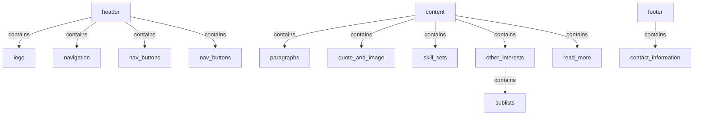

```mermaid
graph TD;
  A[header] -->|contains| B[logo];
  A[header] -->|contains| C[navigation];
  A[header] -->|contains| D[nav_buttons];
  A[header] -->|contains| E[nav_buttons];
  F[content] -->|contains| G[paragraphs];
  F[content] -->|contains| H[quote_and_image];
  F[content] -->|contains| I[skill_sets];
  F[content] -->|contains| J[other_interests];
  J[other_interests] -->|contains| K[sublists];
  F[content] -->|contains| L[read_more];
  M[footer] -->|contains| N[contact_information];
```